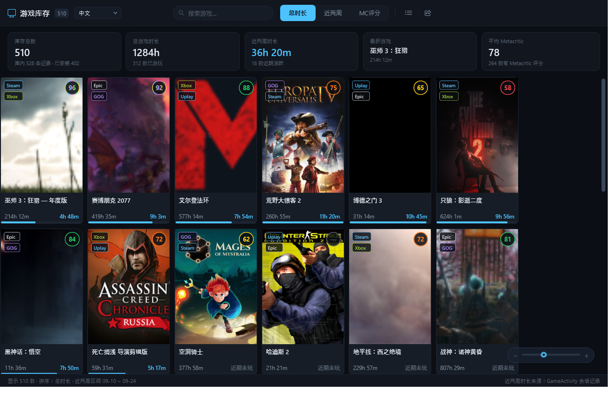
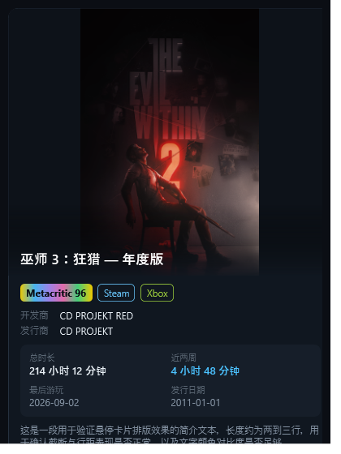
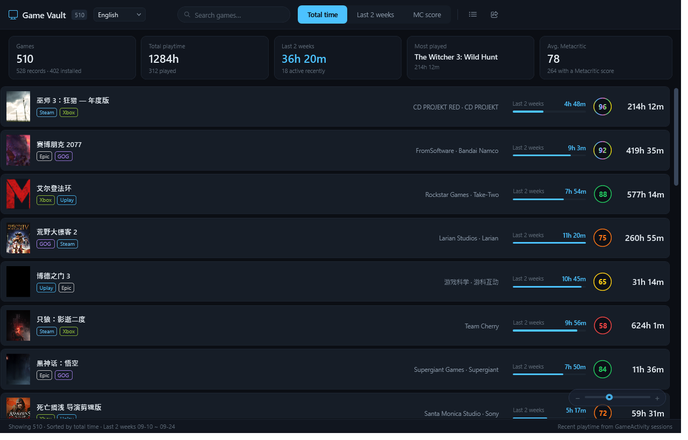

# GameVault

English | **简体中文**　·　[中文说明](README.md)

> A visual game-library vault for Playnite — see what you own, how long you've played it, and which platforms you own it on.



---

## What is this

Playnite's built-in statistics page (`controls/librarystatistics.xaml`) is **BAML compiled into the main executable** — themes can restyle it but cannot change its structure. GameVault is a standalone plugin that adds a **Game Vault** view to the sidebar, implementing a visual library browser from scratch.

## Features

**Browsing**
- Sort by **Total playtime / Last 2 weeks / Metacritic score**
- Grid (poster wall) and Bar (compact list) views, switchable at any time
- Live search by name

**Multi-platform ownership**
Copies of the same game across Steam / Epic / Xbox / GOG / EA / PSN are **merged by name** into a single entry — playtime is summed and coloured source badges are shown on each card.

**Hover details**
Hovering a card reveals a panel with the full poster (uncropped), Metacritic score, developer, publisher, total playtime, last-2-weeks playtime, last played date, release date, and description.



**Bar view**



**Responsive zoom**
A draggable zoom bar sits in the bottom-right corner: dragging resizes cards **live** and columns reflow automatically (resizing the Playnite window does too). Click the bar and use `←` `→` for fine adjustment. The size is persisted across restarts.

**Metacritic colour scale**

| Score | Appearance |
| --- | --- |
| 90+ | Flowing rainbow gradient (multiple colours visible at once) |
| 80–89 | Green |
| 70–79 | Orange |
| 60–69 | Yellow |
| Below 60 | Red |

**Bilingual UI**
Switch between 中文 / English from the dropdown next to the title in the top-left. The choice is remembered.

**Misc**
- Double-clicking a card jumps to the Playnite library view with that game selected (it does **not** launch the game)
- One-click copy of a library summary: total count / total playtime / last 2 weeks / most-played / average Metacritic / Top 10 for the current sort

## Installation

### Option 1 — Playnite add-on browser (recommended)
If this add-on has been accepted into the official database: Playnite → **Add-ons** → **Extensions** → Browse, search for `GameVault` and install.

### Option 2 — Install from `.pext`
1. Download `GameVault_x.y.z.pext` from [Releases](../../releases/latest)
2. Playnite → **Add-ons** → **Extensions** → **Install from file** (bottom right) → pick the file
3. Restart Playnite when prompted

### Option 3 — Manual deployment
Copy `extension.yaml`, `GameVault.dll`, and `icon.png` into:

```
%AppData%\Playnite\Extensions\7f3a91c4-6e28-4d15-b0aa-4c19d7e53b82\
```

> ⚠️ **You must fully exit Playnite when updating.** With *Close to tray* enabled, closing the window only hides it — the process keeps running, holds the plugin DLL, and the new version will never load. Right-click the tray icon → **Exit**.

## Usage

After restarting, click **Game Vault** in the left sidebar.
If it isn't there: main menu → **Add-ons** → enable *Show in sidebar* for GameVault.

## Where the data comes from

| Data | Source |
| --- | --- |
| Total playtime, Metacritic score, developer, publisher, artwork | Playnite game database |
| Last-2-weeks playtime | Session history recorded by the **[GameActivity](https://github.com/JosefNemec/PlayniteExtensions)** plugin |

> ⚠️ Playnite itself **only stores total playtime** and keeps no session history. Last-2-weeks playtime depends entirely on GameActivity — without it the column shows 0 and the status bar tells you why.
>
> Calculation: reads GameActivity session files (`ExtensionsData\<id>\GameActivity\<gameId>.json`) and sums entries within the past 14 days (UTC).

## Building from source

Requirements: **.NET SDK** (target framework `net48`) and a **Playnite installation** (for `Playnite.SDK.dll`).

`GameVault.csproj` references `F:\Playnite\Playnite.SDK.dll` via HintPath by default — change it to your own path:

```xml
<Reference Include="Playnite.SDK">
  <HintPath>your\path\to\Playnite.SDK.dll</HintPath>
  <Private>false</Private>
</Reference>
```

Then build:

```bash
dotnet build -c Release
```

Output: `bin/Release/GameVault.dll`.

### Packaging into .pext

A `.pext` is just a zip with a different extension — put all three files at the **archive root**. A script is included:

```bash
python scripts/package.py
```

It reads the version from `extension.yaml` and produces `GameVault_<version>.pext`.

## Releasing a new version

The **git tag is the single source of truth** for the version number; CI syncs it into `extension.yaml` and publishes automatically:

```bash
git add -A
git commit -m "feat: something new"

git tag v1.8.2          # the tag is the release version
git push origin main --tags
```

Pushing a tag makes GitHub Actions build, rewrite `Version` in `extension.yaml` from the tag, package the `.pext`, and create a Release with the installer attached.

> Pushes to `main` and pull requests only run a build check — nothing is published.
>
> CI runners have no Playnite installed, so `GameVault.csproj` falls back to the official `PlayniteSDK` NuGet package automatically. No extra CI configuration is needed.

## Implementation notes

- **Must be compiled as `net48`.** Playnite 10.x is a .NET Framework application whose `Playnite.SDK.dll` references `mscorlib` / `System.Xaml` 4.0.0.0 — it cannot be used from .NET 8/9.
- The view XAML ships as an **embedded resource** and is parsed at runtime with `XamlReader.Parse`, sidestepping the friction of XAML compilation under net48.
- The bilingual UI uses a **resource dictionary + `DynamicResource`**: the hover panel lives inside a `ToolTip` and is not part of the visual tree, where ordinary bindings cannot reach — dynamic resources can.
- The grid view uses a `WrapPanel` plus **incremental loading** (150 items per batch). A wrapping panel cannot be virtualized, but this is what makes column reflow track the zoom slider perfectly in real time.

## Known limitations

- Last-2-weeks playtime requires the GameActivity plugin
- Playnite **Desktop** mode only (Fullscreen is not adapted)
- The grid appends the next batch as you reach the bottom, so the scrollbar length is dynamic for very large libraries

## License

[MIT](LICENSE) © 2026 nizh
