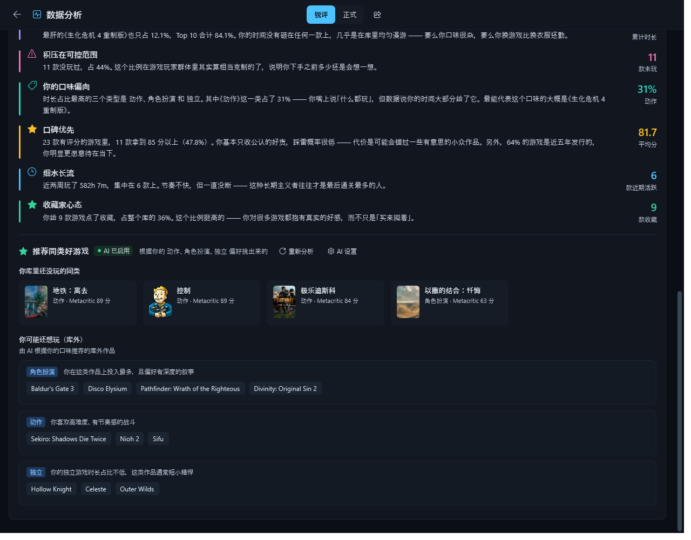
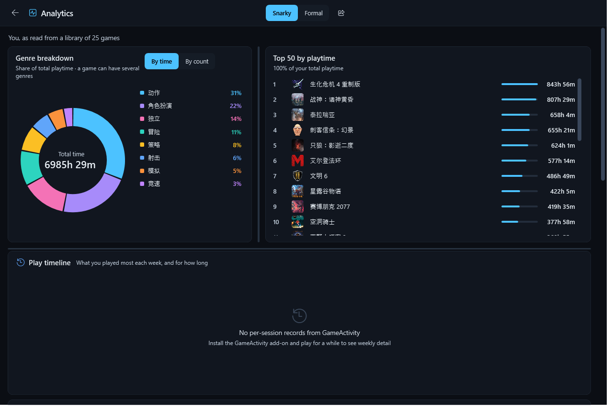

# GameVault

English | **简体中文**　·　[中文说明](README.md)

> A visual game-library vault for Playnite — see what you own, how long you've played it, and which platforms you own it on.


---

## What is this

Playnite's built-in statistics page (`controls/librarystatistics.xaml`) is **BAML compiled into the main executable** — themes can restyle it but cannot change its structure. GameVault is a standalone plugin that adds a **Game Vault** view to the sidebar, implementing a visual library browser from scratch.

## Features

**Browsing**
- Sort by **Total playtime / Last 2 weeks / Metacritic score**
- Grid (poster wall) and Bar (compact list) views, switchable at any time
- Live search by name

**Multi-platform ownership**
Copies of the same game across Steam / Epic / Xbox / GOG / EA / PSN are **merged by name** into a single entry — playtime is summed and coloured source badges are shown on each card.

**Hover details**
Hovering a card reveals a panel with the full poster (uncropped), Metacritic score, developer, publisher, total playtime, last-2-weeks playtime, last played date, release date, and description.


**Bar view**


**Responsive zoom**
A draggable zoom bar sits in the bottom-right corner: dragging resizes cards **live** and columns reflow automatically (resizing the Playnite window does too). Click the bar and use `←` `→` for fine adjustment. The size is persisted across restarts.

**Metacritic colour scale**

| Score | Appearance |
| --- | --- |
| 90+ | Flowing rainbow gradient (multiple colours visible at once) |
| 80–89 | Green |
| 70–79 | Orange |
| 60–69 | Yellow |
| Below 60 | Red |

**Bilingual UI**
Switch between 中文 / English from the dropdown next to the title in the top-left. The choice is remembered.

**Misc**
- Double-clicking a card jumps to the Playnite library view with that game selected (it does **not** launch the game)

## Analytics

Click the chart button in the top-right corner (where the old *copy summary* button used to be) to switch the whole view to the **Analytics** page. The back arrow in its top-left returns you to the vault.


**Genre distribution (donut chart)**
- Groups your library by genre tags and renders a donut chart
- Toggle between two bases: **by playtime** (cumulative time per genre) or **by game count**
- Click any slice or legend row to **jump back to the vault filtered by that genre** — the breakdown is a navigation tool, not just a picture
- Shows the top 9 genres; the rest are merged into *Other*

> A game can belong to several genres (e.g. Action / Adventure / Indie), so the sum of per-genre counts will **exceed** your total library size. That is expected.

**Top 50 by playtime**
The 50 most-played games with rank, share bar, and playtime — so you can see where the hours actually went.

**"What kind of player are you?" report**
Walks the whole library — playtime distribution, concentration, unplayed backlog, genre preference, score preference, recent momentum, and favouriting habits — and produces an **eight-part** player profile, each part carrying one key figure:

| Section | What it reads |
| --- | --- |
| Player archetype | Whether you're a generalist, a specialist, or a collector |
| Play rhythm | Median vs average playtime — grazing or deep diving, plus the share of short games |
| Concentration | Top 1/3/10 share — wide net or a few deep dives |
| Backlog | How many bought-but-never-played, and how much time they represent |
| Genre preference | Your most-invested genre and its share |
| Score taste | Share of highly-rated games and whether your taste is picky |
| Momentum | Your firepower over the last two weeks |
| Favourites | How many games earned your star — i.e. how high your bar for "love" is |

**Similar games you might like**
At the bottom of the report, a few recommendations are generated **from the taste the report just read** (pulled from your top three genres by playtime). Each card shows a cover, the title, and a reason such as "Action · Metacritic 89".
The picker **excludes games you've already played**, favours installed and highly rated ones, and shows at most 8.



**Two tones, switchable anytime**: the **centred** toggle in the top bar flips between **Snarky** (opinionated, a little cheeky) and **Formal** (facts and inferences only).

> Functional buttons are always **centred** (new ones extend outwards) rather than parked in the top-right — that area belongs to the window's minimise/maximise/close buttons, and anything placed there becomes unclickable.

Snarky vs Formal:



**Resizable panels**
Every panel on the Analytics page can be resized: drag the **splitter** between two panels (it turns blue on hover) to change the pie/Top-50 width ratio, or the height ratio between the top row and the report below. Your sizes are **remembered** and restored next time you open the page.

**Fully local — nothing is uploaded**
The report is generated entirely by a local rules engine from your real data. **No network calls, no uploads, no API keys.**

**Bilingual**: the Analytics page follows the same language setting as the vault.

## Installation

### Option 1 — Playnite add-on browser (recommended)
If this add-on has been accepted into the official database: Playnite → **Add-ons** → **Extensions** → Browse, search for `GameVault` and install.

### Option 2 — Install from `.pext`
1. Download `GameVault_x.y.z.pext` from [Releases](../../releases/latest)
2. Playnite → **Add-ons** → **Extensions** → **Install from file** (bottom right) → pick the file
3. Restart Playnite when prompted

### Option 3 — Manual deployment
Copy `extension.yaml`, `GameVault.dll`, and `icon.png` into:

```
%AppData%\Playnite\Extensions\7f3a91c4-6e28-4d15-b0aa-4c19d7e53b82\
```

> ⚠️ **You must fully exit Playnite when updating.** With *Close to tray* enabled, closing the window only hides it — the process keeps running, holds the plugin DLL, and the new version will never load. Right-click the tray icon → **Exit**.

## Usage

After restarting, click **Game Vault** in the left sidebar.
If it isn't there: main menu → **Add-ons** → enable *Show in sidebar* for GameVault.

The top bar on the right has two buttons: **Analytics** (chart icon) opens the analytics page, **Refresh** rescans the library.

## Where the data comes from

| Data | Source |
| --- | --- |
| Total playtime, Metacritic score, developer, publisher, artwork, **genre tags** | Playnite game database |
| Last-2-weeks playtime | Session history recorded by the **[GameActivity](https://github.com/JosefNemec/PlayniteExtensions)** plugin |

> ⚠️ Playnite itself **only stores total playtime** and keeps no session history. Last-2-weeks playtime depends entirely on GameActivity — without it the column shows 0 and the status bar tells you why.
>
> Calculation: reads GameActivity session files (`ExtensionsData\<id>\GameActivity\<gameId>.json`) and sums entries within the past 14 days (UTC).

## Building from source

Requirements: **.NET SDK** (target framework `net48`) and a **Playnite installation** (for `Playnite.SDK.dll`).

`GameVault.csproj` references `F:\Playnite\Playnite.SDK.dll` via HintPath by default — change it to your own path:

```xml
<Reference Include="Playnite.SDK">
  <HintPath>your\path\to\Playnite.SDK.dll</HintPath>
  <Private>false</Private>
</Reference>
```

Then build:

```bash
dotnet build -c Release
```

Output: `bin/Release/GameVault.dll`.

### Packaging into .pext

A `.pext` is just a zip with a different extension — put all three files at the **archive root**. A script is included:

```bash
python scripts/package.py
```

It reads the version from `extension.yaml` and produces `GameVault_<version>.pext`.

## Releasing a new version

Say you want to release `1.0.1` — three things:

```bash
# 1) commit your code and push to main
git add -A
git commit -m "fix: something"
git push origin main

# 2) record the version in the installer manifest (this is what the
#    official add-on database reads to detect new versions)
python scripts/add-release.py 1.0.1 --changelog "fix: something"
git add manifests/installer.yaml
git commit -m "chore: add 1.0.1 to the installer manifest"
git push origin main

# 3) publish: tag it, or run the workflow manually from the Actions tab
git tag v1.0.1
git push origin v1.0.1
```

> ⚠️ **Step 2 is not optional.** CI only rewrites `Version` in `extension.yaml` from the tag;
> it does **not** touch `manifests/installer.yaml` — and that is the file the official add-on
> database reads to decide whether a newer version exists and where to download it. Skip it
> and existing users will never be offered the update.

Pushing a tag makes GitHub Actions build, rewrite `Version` in `extension.yaml` from the tag, package the `.pext`, and create a Release with the installer attached.

> Pushes to `main` and pull requests only run a build check — nothing is published.
>
> CI runners have no Playnite installed, so `GameVault.csproj` falls back to the official `PlayniteSDK` NuGet package automatically. No extra CI configuration is needed.
>
> You can also trigger it manually from the Actions tab: click **Run workflow** and enter the version — same result as pushing a tag, without touching git tags.

### Pre-release self-check

```bash
pip install pyyaml
python scripts/check_manifests.py
```

### Submitting to the official add-on database

The two manifests under `manifests/` are for [PlayniteAddonDatabase](https://github.com/JosefNemec/PlayniteAddonDatabase):

- `manifests/GameVault_<Id>.yaml` — **submit this one**, placed under `addons/generic/` in that repository, as a pull request
- `manifests/installer.yaml` — stays in this repository; the file above references it via `InstallerManifestUrl`

Once merged, users can find and install GameVault — with automatic updates — directly from Playnite's add-on browser.

## Implementation notes

- **Must be compiled as `net48`.** Playnite 10.x is a .NET Framework application whose `Playnite.SDK.dll` references `mscorlib` / `System.Xaml` 4.0.0.0 — it cannot be used from .NET 8/9.
- The view XAML ships as an **embedded resource** and is parsed at runtime with `XamlReader.Parse`, sidestepping the friction of XAML compilation under net48.
- The bilingual UI uses a **resource dictionary + `DynamicResource`**: the hover panel lives inside a `ToolTip` and is not part of the visual tree, where ordinary bindings cannot reach — dynamic resources can.
- The grid view uses a `WrapPanel` plus **incremental loading** (150 items per batch). A wrapping panel cannot be virtualized, but this is what makes column reflow track the zoom slider perfectly in real time.
- The genre donut is a **hand-written control** (`Path` + `ArcSegment`), with no charting dependency: colours, hover pop-out, per-slice entrance animation, and hit-testing are all custom.
- The player profile is a **local rules engine** (`Profile.cs`). It calls no online service, so there is nothing to configure, nothing to pay for, and no data leaves your machine.

## Known limitations

- Last-2-weeks playtime requires the GameActivity plugin
- Playnite **Desktop** mode only (Fullscreen is not adapted)
- The grid appends the next batch as you reach the bottom, so the scrollbar length is dynamic for very large libraries
- Genre stats only count **genre tags actually present** in your library; games without tags trigger a "no genre data" hint
- The player profile is rule-generated, not real LLM output (the trade-off for zero dependencies and full privacy)

## License

[MIT](LICENSE) © 2026 AbyssVII
