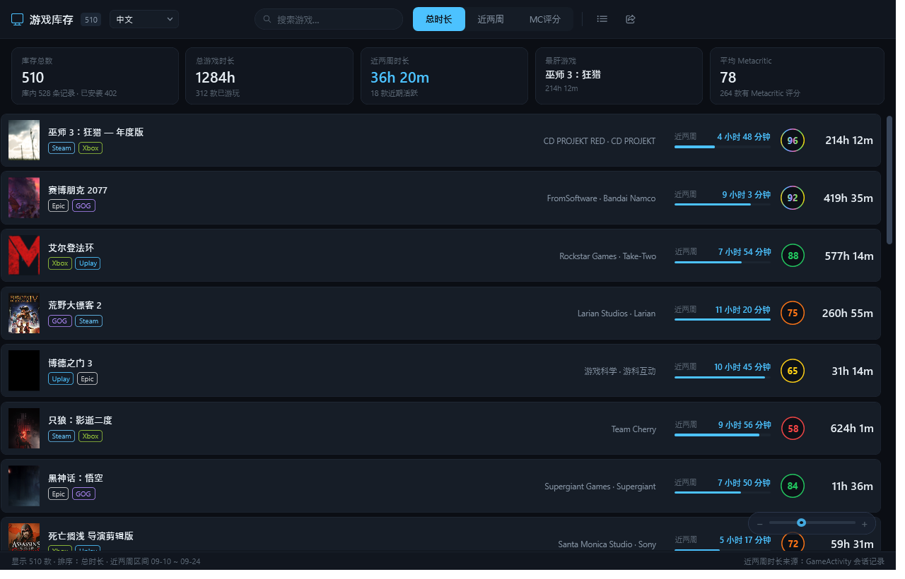

# GameVault · 游戏库存

**English** | 简体中文　·　[English README](README.en.md)

> 给 Playnite 加一个「小黑盒」风格的库存页：一眼看清买过什么、玩了多久、在哪几个平台拥有。
> A visual game-library vault for Playnite.


---

## 这是什么

Playnite 自带的统计界面（`controls/librarystatistics.xaml`）是**编译进主程序的 BAML**，主题只能改配色、改不了结构。GameVault 是一个独立插件，在侧边栏提供「游戏库存」视图，从零实现了一套可视化库存浏览体验。

## 功能

**库存浏览**
- 排序：**总时长 / 近两周 / Metacritic 评分**，一键切换
- 网格（海报墙）与条形（紧凑列表）两种视图随时互切
- 按名称实时搜索过滤

**多平台归属**
同一个游戏在 Steam / Epic / Xbox / GOG / EA / PSN 等平台的多个副本会**按名称自动合并**成一款，时长累加，卡片上显示各自来源的彩色徽章。

**悬停详情**
鼠标停在卡片上会浮出面板：完整海报（等比显示、不裁切）、Metacritic 评分、开发商、发行商、总时长、近两周时长、最后游玩、发行日期、简介。


**条形视图**



**自适应缩放**
右下角有一个可拖动的缩放条：拖动时卡片尺寸**实时**变化、列数自动重排（窗口拉宽拉窄也会跟着变）。点击缩放条后可用 `←` `→` 做微调。尺寸会被记住，重启后保持。

**Metacritic 配色**

| 评分区间 | 表现 |
| --- | --- |
| 90+ | 流光溢彩的彩虹渐变（同一时刻多色并存） |
| 80–89 | 绿 |
| 70–79 | 橙 |
| 60–69 | 黄 |
| 60 以下 | 红 |

**中英双语**
左上角标题右侧的下拉框可即时切换 中文 / English，选择会被记住。

**其他**
- 双击卡片跳转到 Playnite 库视图并选中该游戏（**不会**直接启动游戏）
- 一键复制库存摘要：总数 / 总时长 / 近两周 / 最肝游戏 / 平均 Metacritic / 当前排序 Top 10

## 安装

### 方式一：Playnite 扩展浏览器（推荐）
若本插件已被官方扩展库收录：Playnite → **扩展** → **扩展** 标签 → 浏览，搜索 `GameVault` 直接安装。

### 方式二：从 `.pext` 安装
1. 从 [Releases](../../releases/latest) 下载 `GameVault_x.y.z.pext`
2. Playnite → **扩展** → **扩展** → 右下角 **「从文件安装」** → 选择该文件
3. 按提示重启 Playnite

### 方式三：手动部署
把 `extension.yaml`、`GameVault.dll`、`icon.png` 放进：

```
%AppData%\Playnite\Extensions\7f3a91c4-6e28-4d15-b0aa-4c19d7e53b82\
```

> ⚠️ **更新插件时必须真正退出 Playnite。** 如果你开了「关闭到托盘」（`CloseToTray`），关窗口只是缩到托盘、进程仍在运行，插件文件被占用无法覆盖，新版本也不会加载。请从托盘图标右键 → **退出**。

## 使用

重启后在左侧边栏点 **「游戏库存」**。
如果没有出现：主菜单 → **扩展** → 勾选 GameVault 的「在侧边栏显示」。

## 数据从哪来

| 数据 | 来源 |
| --- | --- |
| 总时长、Metacritic 评分、开发商、发行商、海报 | Playnite 游戏库 |
| 近两周时长 | **[GameActivity](https://github.com/JosefNemec/PlayniteExtensions)** 插件的历史会话记录 |

> ⚠️ Playnite 本体**只保存总时长**，不记录分段历史。近两周时长完全依赖 GameActivity —— 未安装时该列显示为 0，状态栏会给出提示。
>
> 计算方式：读取 GameActivity 的会话文件（`ExtensionsData\<id>\GameActivity\<gameId>.json`），按最近 14 天的 UTC 时间窗累加。

## 从源码构建

前置条件：**.NET SDK**（目标框架 `net48`）、**Playnite 本体**（提供 `Playnite.SDK.dll`）。

`GameVault.csproj` 默认通过 HintPath 引用 `F:\Playnite\Playnite.SDK.dll`，请改成你自己的安装路径：

```xml
<Reference Include="Playnite.SDK">
  <HintPath>你的路径\Playnite.SDK.dll</HintPath>
  <Private>false</Private>
</Reference>
```

然后编译：

```bash
dotnet build -c Release
```

产物为 `bin/Release/GameVault.dll`。

### 打包成 .pext

`.pext` 就是改了扩展名的 zip，把三个文件放在压缩包**根目录**即可。仓库里已经带了脚本：

```bash
python scripts/package.py
```

它会读取 `extension.yaml` 里的版本号，生成 `GameVault_<版本>.pext`。

## 发布新版本

版本号以 **git tag 为唯一来源**，CI 会自动把它同步进 `extension.yaml` 并打包发布：

```bash
git add -A
git commit -m "feat: 某个新功能"

git tag v1.8.2          # 标签号就是发布版本号
git push origin main --tags
```

推送标签后，GitHub Actions 会自动完成：编译 → 按标签改写 `extension.yaml` 的 `Version` → 打包 `.pext` → 创建 Release 并把安装包作为附件上传。

> 只推送到 `main` 或提交 PR 时，仅跑一次编译检查，不会发布。
>
> CI 构建机上没有 Playnite，`GameVault.csproj` 会自动回退到 NuGet 上的官方 `PlayniteSDK` 包，因此云端构建无需任何额外配置。

改动清单后建议自检一遍（校验必填字段、版本号、AddonId、仓库地址是否自洽）：

```bash
pip install pyyaml
python scripts/check_manifests.py
```

### 提交到官方扩展库

`manifests/` 下那两份清单是为 [PlayniteAddonDatabase](https://github.com/JosefNemec/PlayniteAddonDatabase) 准备的：

- `manifests/GameVault_<Id>.yaml` —— **提交给官方库**，放到该仓库的 `addons/generic/` 目录下提 PR
- `manifests/installer.yaml` —— 留在本仓库，供上面那份的 `InstallerManifestUrl` 引用

审核合并后，其他用户就能在 Playnite 的扩展浏览器里搜到并一键安装、自动更新。

## 技术说明

- **必须编译为 `net48`。** Playnite 10.x 是 .NET Framework 应用，其 `Playnite.SDK.dll` 引用 `mscorlib` / `System.Xaml` 4.0.0.0，不能用 .NET 8/9 编译。
- 界面 XAML 以**嵌入资源**形式打包，运行时用 `XamlReader.Parse` 加载，避开了 net48 下 XAML 编译的配置麻烦。
- 中英双语用**资源字典 + `DynamicResource`** 实现：悬停详情卡片位于 `ToolTip` 中、不在可视树上，普通绑定够不着，只有动态资源能覆盖。
- 网格视图用 `WrapPanel` 换行 + **分批加载**（每批 150 项）：换行面板不支持虚拟化，但只有这样拖动缩放条时才能完全跟手地实时重排。

## 已知限制

- 近两周时长依赖 GameActivity 插件
- 仅适配 Playnite **Desktop** 模式（Fullscreen 未适配）
- 网格视图滚动到底部时会追加下一批，超大库存下滚动条长度是动态的

## 许可

[MIT](LICENSE) © 2026 nizh
