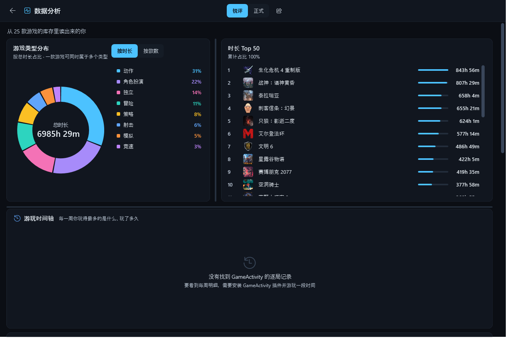

# GameVault · 游戏库存

**English** | 简体中文　·　[English README](README.en.md)

> 给 Playnite 加一个「小黑盒」风格的库存页：一眼看清买过什么、玩了多久、在哪几个平台拥有。
> A visual game-library vault for Playnite.


---

## 这是什么

Playnite 自带的统计界面（`controls/librarystatistics.xaml`）是**编译进主程序的 BAML**，主题只能改配色、改不了结构。GameVault 是一个独立插件，在侧边栏提供「游戏库存」视图，从零实现了一套可视化库存浏览体验。

## 功能

**库存浏览**
- 排序：**总时长 / 近两周 / Metacritic 评分**，一键切换
- 网格（海报墙）与条形（紧凑列表）两种视图随时互切
- 按名称实时搜索过滤

**多平台归属**
同一个游戏在 Steam / Epic / Xbox / GOG / EA / PSN 等平台的多个副本会**按名称自动合并**成一款，时长累加，卡片上显示各自来源的彩色徽章。

**悬停详情**
鼠标停在卡片上会浮出面板：完整海报（等比显示、不裁切）、Metacritic 评分、开发商、发行商、总时长、近两周时长、最后游玩、发行日期、简介。


**条形视图**


**自适应缩放**
右下角有一个可拖动的缩放条：拖动时卡片尺寸**实时**变化、列数自动重排（窗口拉宽拉窄也会跟着变）。点击缩放条后可用 `←` `→` 做微调。尺寸会被记住，重启后保持。

**Metacritic 配色**

| 评分区间 | 表现 |
| --- | --- |
| 90+ | 流光溢彩的彩虹渐变（同一时刻多色并存） |
| 80–89 | 绿 |
| 70–79 | 橙 |
| 60–69 | 黄 |
| 60 以下 | 红 |

**中英双语**
左上角标题右侧的下拉框可即时切换 中文 / English，选择会被记住。

**其他**
- 双击卡片跳转到 Playnite 库视图并选中该游戏（**不会**直接启动游戏）

## 数据分析

点右上角的图表按钮（原「复制摘要」的位置）进入**数据分析**页，整页切换，点左上角返回箭头回到库存页。


**游戏类型分布（环形饼图）**
- 按游戏类型标签（Genres）自动归类，绘制成环形饼图
- 两种统计口径一键切换：**按时长**（各类型累计游玩时间）或 **按款数**
- 点击任意一瓣或图例，**直接跳回库存页并按该类型过滤**——分类不只是看看，还能用来找游戏
- 只展示前 9 个类型，其余合并为「其他」

> 一款游戏可以同时属于多个类型（如「动作 / 冒险 / 独立」），所以按类型统计的款数之和会**大于**库存总数，属正常现象。

**游戏时长 Top 50**
右侧列出游玩时间最长的 50 款游戏，带排名、条形占比与时长，一眼看出时间都花哪儿了。

**「你是一个什么样的玩家」报告**
遍历整个库存的时长分布、集中度、未玩积压、类型偏好、评分偏好、近期活跃度与收藏习惯，生成**八段式**玩家画像，每段都附一个关键数字：

| 段落 | 看什么 |
| --- | --- |
| 玩家原型 | 从时长分层判断你是通吃型、专注型还是收集型 |
| 游玩节奏 | 中位时长 vs 平均时长的差距 —— 是浅尝辄止还是死磕几款，以及库里短平快作品的比例 |
| 时长集中度 | Top 1/3/10 占比 —— 是广撒网还是死磕几款 |
| 未玩积压 | 买而未玩的数量与堆放时长 |
| 类型偏好 | 最投入的类型及其份额 |
| 评分偏好 | 库里高分占比，以及你的品味是否挑剔 |
| 近期活跃度 | 近两周的投入火力 |
| 收藏习惯 | 你给多少款游戏点过收藏，判断"喜欢"的门槛有多高 |

**推荐同类好游戏**
报告底部会**根据上面读出来的口味自动推荐**几款同类型作品（从你时长占比最高的三个类型里挑），每张卡片配封面、名称与推荐理由（如「动作 · Metacritic 89 分」）。
挑选逻辑会**排除你已经玩过的游戏**，优先推已安装、评分高的，最多 8 款。

 

**AI 库外推荐（可选，需自备 API Key）**
上面的推荐只能推**你库里已有的**游戏。想要「库外同类好游戏」，可以在推荐区右上角点 **AI 设置**，填入任意 **OpenAI 兼容接口**的 API Key（默认走**火山方舟 / 豆包**）：

- 只把**口味摘要**（各类型时长占比 + 十来款代表作）发给模型，**不上传整个游戏库**；
- 模型按类型分类返回库外推荐，每个类型一组，附一句推荐理由；
- 没配 Key 或调用失败时**静默回退**到本地推荐，不影响其它功能；
- Key 只存在本地 `settings.json`，不会上传到任何第三方。

**游玩时间轴（按月/周）**
以月为间隔横向排布，每一根柱子是**一周**：柱高 = 当周游玩时长，悬停显示那一周**玩得最多的游戏**与时长。数据来自 **GameActivity** 插件的逐局记录（没装则显示空态指引）。

**分享长图**
右上角的分享按钮**不再是复制文字**，而是生成一张**专门排版的竖版分享长图**（1080 宽，2× 高清）：顶部概况 + 四宫格关键数字 + 类型分布条 + 时长 Top 8 + 玩家画像摘要 + 页脚。生成后**自动复制到剪贴板**，同时保存到 `图片\GameVault\` 目录，可以直接粘到聊天窗或论坛发帖。

**两种文风随时切换**：顶栏**居中**的开关可在「**锐评**」（有观点、会调侃）与「**正式**」（只陈述事实与推论）之间切换。

> 功能按钮一律**居中排布**（新增按钮再向两侧扩展），而不是靠右上角 —— 窗口右上角是系统的最小化/最大化/关闭按钮，放那儿会点不到。

锐评 vs 正式：



**面板可自由调整大小**
分析页的每一块都可以拖拽调整：按住两块面板之间的**分隔条**（悬停会变成蓝色）拖动即可 —— 可以改饼图和 Top 50 的左右宽度比，也可以改上半部分和报告区的上下高度比。调整过的尺寸会**自动记住**，下次打开还是你喜欢的样子。

**全本地，不上传**
报告完全由本地规则引擎按你的真实数据生成，**不联网、不上传任何数据、不需要 API key**。

**中英双语**：分析页与库存页一样跟随左上角的语言设置。

## 安装

### 方式一：Playnite 扩展浏览器（推荐）
若本插件已被官方扩展库收录：Playnite → **扩展** → **扩展** 标签 → 浏览，搜索 `GameVault` 直接安装。

### 方式二：从 `.pext` 安装
1. 从 [Releases](../../releases/latest) 下载 `GameVault_x.y.z.pext`
2. Playnite → **扩展** → **扩展** → 右下角 **「从文件安装」** → 选择该文件
3. 按提示重启 Playnite

### 方式三：手动部署
把 `extension.yaml`、`GameVault.dll`、`icon.png` 放进：

```
%AppData%\Playnite\Extensions\7f3a91c4-6e28-4d15-b0aa-4c19d7e53b82\
```

> ⚠️ **更新插件时必须真正退出 Playnite。** 如果你开了「关闭到托盘」（`CloseToTray`），关窗口只是缩到托盘、进程仍在运行，插件文件被占用无法覆盖，新版本也不会加载。请从托盘图标右键 → **退出**。

## 使用

重启后在左侧边栏点 **「游戏库存」**。
如果没有出现：主菜单 → **扩展** → 勾选 GameVault 的「在侧边栏显示」。

右侧顶栏有两个按钮：**数据分析**（图表图标）进入分析页，**刷新**重新扫描库存。

## 数据从哪来

| 数据 | 来源 |
| --- | --- |
| 总时长、Metacritic 评分、开发商、发行商、海报、**游戏类型标签** | Playnite 游戏库 |
| 近两周时长 | **[GameActivity](https://github.com/JosefNemec/PlayniteExtensions)** 插件的历史会话记录 |

> ⚠️ Playnite 本体**只保存总时长**，不记录分段历史。近两周时长完全依赖 GameActivity —— 未安装时该列显示为 0，状态栏会给出提示。
>
> 计算方式：读取 GameActivity 的会话文件（`ExtensionsData\<id>\GameActivity\<gameId>.json`），按最近 14 天的 UTC 时间窗累加。

## 从源码构建

前置条件：**.NET SDK**（目标框架 `net48`）、**Playnite 本体**（提供 `Playnite.SDK.dll`）。

`GameVault.csproj` 默认通过 HintPath 引用 `F:\Playnite\Playnite.SDK.dll`，请改成你自己的安装路径：

```xml
<Reference Include="Playnite.SDK">
  <HintPath>你的路径\Playnite.SDK.dll</HintPath>
  <Private>false</Private>
</Reference>
```

然后编译：

```bash
dotnet build -c Release
```

产物为 `bin/Release/GameVault.dll`。

### 打包成 .pext

`.pext` 就是改了扩展名的 zip，把三个文件放在压缩包**根目录**即可。仓库里已经带了脚本：

```bash
python scripts/package.py
```

它会读取 `extension.yaml` 里的版本号，生成 `GameVault_<版本>.pext`。

## 发布新版本

假设要发布 `1.0.1`，一共三件事：

```bash
# 1) 改代码并推送到 main
git add -A
git commit -m "fix: 修复 xxx"
git push origin main

# 2) 把新版本写进安装清单（官方扩展库靠它判断有没有新版本）
python scripts/add-release.py 1.0.1 --changelog "修复 xxx"
git add manifests/installer.yaml
git commit -m "chore: 安装清单加入 1.0.1"
git push origin main

# 3) 发布：打标签，或在 Actions 页面点 Run workflow 并填 1.0.1
git tag v1.0.1
git push origin v1.0.1
```

> ⚠️ **第 2 步不能省。** CI 只会按标签改写 `extension.yaml` 的 `Version`，**不会**动
> `manifests/installer.yaml` —— 而官方扩展库正是读它来决定「有没有新版本、去哪里下载」。
> 漏掉这一步，已安装的用户就永远收不到更新提示。

推送标签后，GitHub Actions 会自动完成：编译 → 按标签改写 `extension.yaml` 的 `Version` → 打包 `.pext` → 创建 Release 并把安装包作为附件上传。

> 只推送到 `main` 或提交 PR 时，仅跑一次编译检查，不会发布。
>
> CI 构建机上没有 Playnite，`GameVault.csproj` 会自动回退到 NuGet 上的官方 `PlayniteSDK` 包，因此云端构建无需任何额外配置。
>
> 也可以在 Actions 页面手动触发：点 **Run workflow**、填版本号，效果与打标签相同，且不需要动 git 标签。

### 发布前自检

```bash
pip install pyyaml
python scripts/check_manifests.py
```

### 提交到官方扩展库

`manifests/` 下那两份清单是为 [PlayniteAddonDatabase](https://github.com/JosefNemec/PlayniteAddonDatabase) 准备的：

- `manifests/GameVault_<Id>.yaml` —— **提交给官方库**，放到该仓库的 `addons/generic/` 目录下提 PR
- `manifests/installer.yaml` —— 留在本仓库，供上面那份的 `InstallerManifestUrl` 引用

审核合并后，其他用户就能在 Playnite 的扩展浏览器里搜到并一键安装、自动更新。

## 技术说明

- **必须编译为 `net48`。** Playnite 10.x 是 .NET Framework 应用，其 `Playnite.SDK.dll` 引用 `mscorlib` / `System.Xaml` 4.0.0.0，不能用 .NET 8/9 编译。
- 界面 XAML 以**嵌入资源**形式打包，运行时用 `XamlReader.Parse` 加载，避开了 net48 下 XAML 编译的配置麻烦。
- 中英双语用**资源字典 + `DynamicResource`** 实现：悬停详情卡片位于 `ToolTip` 中、不在可视树上，普通绑定够不着，只有动态资源能覆盖。
- 网格视图用 `WrapPanel` 换行 + **分批加载**（每批 150 项）：换行面板不支持虚拟化，但只有这样拖动缩放条时才能完全跟手地实时重排。
- 类型饼图是**手写控件**（`Path` + `ArcSegment` 画环形），不依赖任何图表库：配色、悬停外推、逐瓣入场动画与命中测试全部自定。
- 「玩家画像」是**纯本地规则引擎**（`Profile.cs`），不调用任何在线接口，因此零配置、零费用、不泄露数据。

## 已知限制

- 近两周时长依赖 GameActivity 插件
- 仅适配 Playnite **Desktop** 模式（Fullscreen 未适配）
- 网格视图滚动到底部时会追加下一批，超大库存下滚动条长度是动态的
- 类型分布只统计 Playnite 库里**已填写的类型标签**；未标注类型的游戏会显示「无类型数据」提示
- 玩家画像基于规则生成，不是真正的 AI 大模型输出（换取了零依赖与隐私）

## 许可

[MIT](LICENSE) © 2026 AbyssVII
